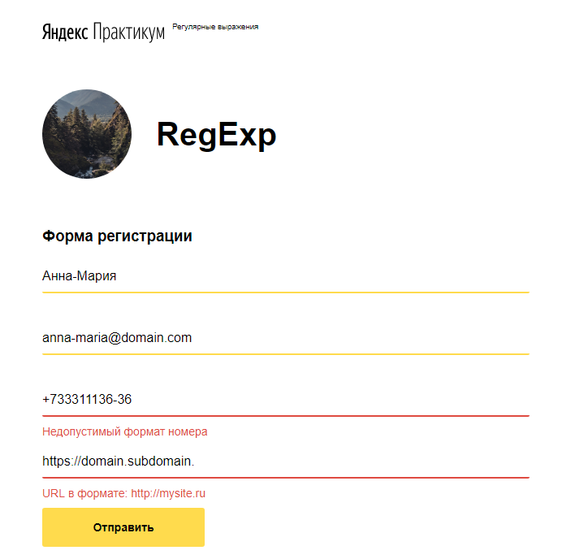

# **RegExp**

https://ustyuzhanina.github.io/sprint-10-validation/index.html

This project was accomplished to learn the RegExp techniques and the way how validation can be done through HTML markup without Javascript language.

_Project version_ **v0.0.3**

> To write a good regular expression you should predict, what a User might write or not write because of forgetting/missing/not willing to write, but finally maybe he actually decides to write something particular and clear, but not meeting your expectations. That's for sure...or not.

---

## Getting Started
To access the page with the form validated by means of **RegExp**, follow the link specified in #1 herein.
To check the validation process fill in the form. Validation is solely operated by index.html. All applicable styles are specified in style.css.

### **Prerequisites**
Everything you need is a common browser and internet connection.

### **Used technologies**
CSS, HTML, GIT

---

## Tests

### **Test Strings from the Technical Task**
*The corresponding fields should successfully validate the samples given below*

**Field 1 - Name**

> Ян 
Максим 
Серёга 
Ёль 
Джон-Дон 

**Field 2 - Email**

> ya2@2ya.ru - имя и домен могут содержать цифры 
ya-e@ya-ya.ru - имя и домен могут содержать тире 
ya@x.ru - доменное имя может состоять из одного символа 
y@ya.ru - имя ящика может состоять из одного символа 
some@mail.ya.ru - доменное имя может содержать поддомен 

**Field 3 - Phone number** (Russian number)

> +7(925)900-90-90 
+7(925) 900-90-90 
+7 925-900-90-90 
+79259009090 
89259009090 

**Field 4 - URL**

> http://ya.ru 
https://www.ya.ru 
http://2-domains.ru 
http://ya.ru:98/ 
http://ya.com:30 
http://ya.ru/path/to/deep/ 
http://ya-ya-ya.ru 
http://8.8.8.8:8080 
http://8.8.8.8:8080/page/to/deep# 

---

## Authors
* **Elena Ustyuzhanina** - *Initial work* - [RegExp](https://ustyuzhanina.github.io/sprint-10-validation/index.html)

---

## Acknowledgments
* Thanks to all people that created regular expressions technology. Writing one reminds me of an entertaining arcade.

---

## Further development and contact
Comments and advice on possible improvement of the regular expressions patterns will be highly appreciated.
You can reach me at elena.ustyuzhanina.rus@gmail.com
Further means of communication soon coming.

